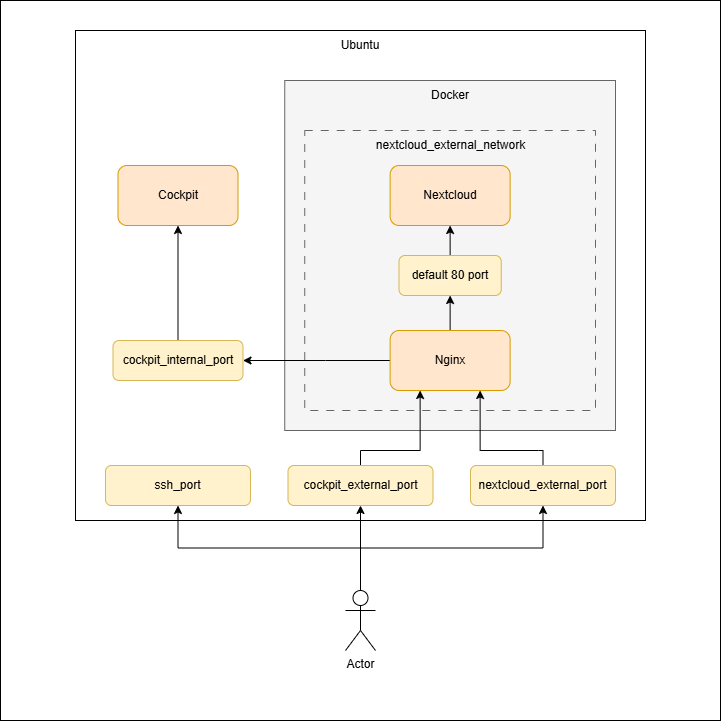

# Overview

**Services:**
- Cockpit
- Nextcloud
- Nginx (proxy)

## Server requirements

**OS:** Ubuntu Server 24.04.2 LTS

1. `sudo apt install net-tools`
2. `sudo apt install openssh-server -y`
3. `sudo apt install python3`
4. `sudo apt install python3-pip -y`

## Folder structure

```text
/
├── etc/
│   ├── cockpit/
│   │   └── cockpit.conf                # [Cockpit] Cockpit config for proxying
│   └── systemd/
│       └── system/
│           ├──cockpit.socket.d/
│           │  └── listen.conf          # [Cockpit] Cockpit socket config
│           ├── nginx.service           # [Nginx] Nginx service
│           └── nextcloud.service       # [Nextcloud] Nextcloud service
│
├── opt/
│   ├── nextcloud/
│   │   ├── docker-copmose.yml          # [Nextcloud] Nextcloud docker compose 
│   │   └── .env                        # [Nextcloud] Environment for docker compose 
│   │
│   └── nginx/
│       ├── config/
│       │   ├── config.d/
│       │   │   ├── cockpit.conf        # [Nginx] Nginx config for cockpit
│       │   │   └── nextcloud.conf      # [Nginx] Nginx config for nextcloud
│       │   └── nginx.conf              # [Nginx] Main nginx config (includes config.d)
│       ├── ssl/
│       │   ├── server.key              # [Nginx] Private key
│       │   └── server.crt              # [Nginx] Certificate
│       └── docker-compose.yml          # [Nginx] Nginx docker compose
│
├── {{ nginx_logs }}/
│   ├── cockpit/                        # [Nginx] Cockpit access and error logs
│   └── nextcloud/                      # [Nginx] Nextcloud access and error logs
│
└── {{ nextcloud_data_directory }}/
    ├── app_data/
    │   ├── data/                       # [Nextcloud] Nextcloud data of all users
    │   └── config/
    │       └──config.php               # [Nextcloud] Main nextcloud config
    └── db/                             # [Nextcloud] Nextcloud database data
 ```

## Network diagram



#### TODO: 
- Close cockpit_internal_port
- Use special users and chmod

# Commands

### Create certificates

Run in `certs` directory with correct ip:
```shell
./generate.sh 172.24.6.204
```

Reuslts:
```
rootCA.crt - Root certificate (to install)
rootCA.key - Private root key (to sign server certsificates)
rootCA.srl - The number of the last server certificate (to sign the next certificate)

server.crt - Server certificate
server.key - Server private key

Auxiliary files: server.csr, san.cnf
```

### Run ansible

Run in `ansible` directory:
```shell
ansible-playbook \
    -i inventory_example.yml \
    -u user --ask-pass --ask-become-pass \
    server.yml
```

